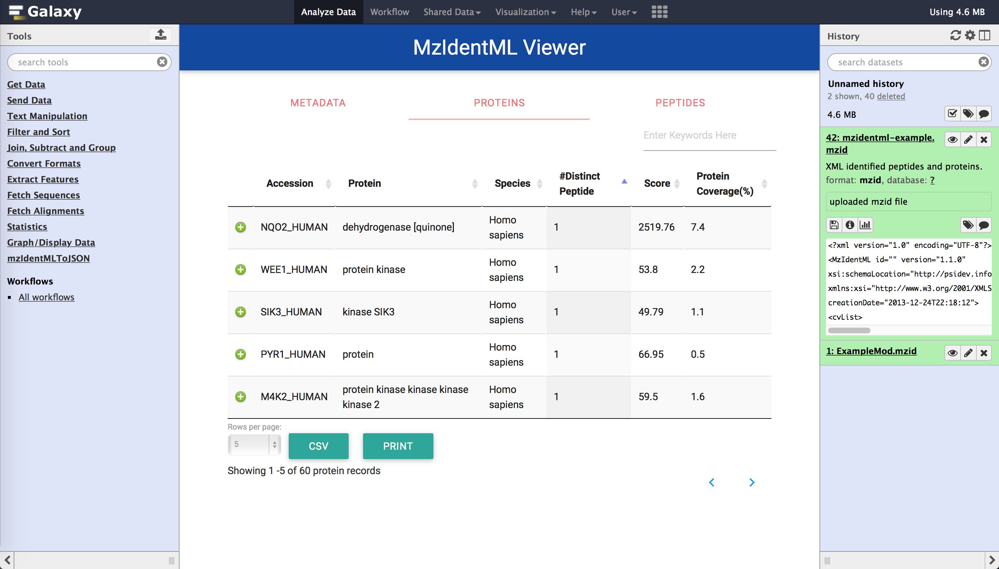
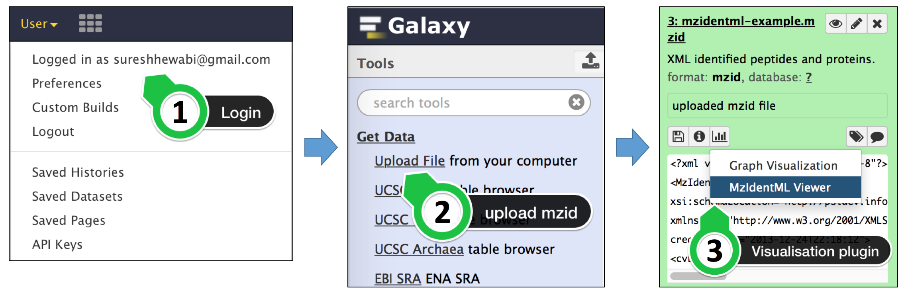

# mzIdentMLVisualiser



This is an interactive web visualisation plug-in for the [mzIdentML](http://www.psidev.info/mzidentml) file within the [Galaxy bioinformatics platform](https://galaxyproject.org). This repository provides you the source code of the java library and other installation files to integrate visualisation plugin into your existing galaxy instance. There are four main folders:
* source - mzIdentMLExtractor java library which converts proteomics data of mzIdentML to JSON files [Not required for the installation]
* plugin - Galaxy visualisation plugin
* tool - Galaxy tool
* samples - sample configurations and other sample files

Galaxy visualisation plugin files are organised into two folders which are called *protviewer* and *webcontroller*.
Additionally, we have a galaxy tool called "mzIdentMLToJSON" which generates temporary JSON files to speed up data loading for visualisation plugin. You must integrate both plugin and tool in order to work with the visualisation, as galaxy tool contains dependency files for the visualisation plugin too. Although the integration of both plugin and tool is mandatory for installation, you can use plugin independently without using galaxy tool. However, we strongly recommend to use our galaxy tool prior to visualise mzIdentML files for a much faster visualising speed.

## Installation

Installation instructions are provided below. These instructions assume that you already have Galaxy installed and have admin access to that installation. If you do not already installed Galaxy or not having admin access, please refer link [here](https://wiki.galaxyproject.org/Admin/GetGalaxy).

In order to proceed, please download our repository to your machine by cloning the repository. If you download as a zip file, then extract the zip file.

### Install Galaxy Visualisation Plugin

#### Step 1 - Enable visualisation feature of Galaxy
* You need to make sure, you have enabled visualisation plugins on your Galaxy installation. First, go to your *galaxy.ini* configuration file (located in ```<your galaxy directory>/config/```). If you do not have a *galaxy.ini* file, but have a *galaxy.ini.sample* file, then make a copy of *galaxy.ini.sample* file and rename it to *galaxy.ini*. Secondly, search for *visualization_plugins_directory* setting in that  *galaxy.ini* file . If this setting has not already set, assign your visualisation directory/uncomment the line as follows :

```bash
# Visualizations config directory: where to look for individual visualization plugins.
# The path is relative to the Galaxy root dir. To use an absolute path begin the path
# with '/'.
visualization_plugins_directory = config/plugins/visualizations
```
As a guidance to above step, we have provided you a sample configuration file(galaxy.ini) in *samples* folder.

#### Step 2 - Copy *protviewer* folder into your visualisations directory
* Copy the given entire *protviewer* folder in the *plugin* folder to ```<your galaxy directory>/config/plugins/visualizations/``` folder

#### Step 3 - Copy *webcontroller* files into your web API Controller 
*  You are given two files in the *webcontroller* folder in the *plugin* folder with the mzIdentMLVisualiser repository which are namely:
  * MzIdentMLHandler.py
  * SequenceExtractor.py They has to be copied into your galaxy instance at ```<your galaxy directory>/lib/galaxy/webapps/galaxy/api/``` location.

* Then, in your galaxy, you should be able to find a file called **datasets.py** at the same location(```<your galaxy directory>/lib/galaxy/webapps/galaxy/api/```). There, copy and paste following codes:

  * Import these modules first:
   ```python
      from SequenceExtractor import SequenceExtractor
      import os.path
      import subprocess
   ```
  * There, paste following code inside Class **DatasetsController** -> method **show**:
   ```python
        elif data_type == 'mzidentml':
            # input mzIdentML file
            inputfile = kwd.get('filename')
            # unique security encoded id assigned for the input file
            datasetId = kwd.get('datasetId')
            rval = inputfile
            # <your galaxy directory> + paths
            outputfile = os.getcwd() + "/config/plugins/visualizations/protviewer/static/data/"
            tempFile = os.getcwd() + "/config/plugins/visualizations/protviewer/static/data/" + datasetId + "_protein.json"
            libraryLocation = os.getcwd() + "/tools/mzIdentMLToJSON/mzIdentMLExtractor.jar"
            multithreading = "true"
            # initial run
            if kwd.get('mode') == 'init':
                # if temporary JSON files not generated
                if os.path.isfile(tempFile) == False:
                    # call mzIdentMLExtractor java library
                    return subprocess.call(['java', '-jar',libraryLocation, inputfile, outputfile, datasetId, multithreading])
                else:
                    print "Info: Data loaded from the cache!"
            elif kwd.get('mode') == 'sequence':
                dbSequenceId = kwd.get('dbSequenceId')
                # extract the sequence
                seqEx = SequenceExtractor()
                sequence = seqEx.extract(inputfile, dbSequenceId)
                rval = sequence
                return rval
    ```
    Warning: **Mind your indentation!** As a guidance for the above step, you can find a sample *datasets.py* file in *sample* folder.

### Install Galaxy Tool

#### Step 1 - Configure Tool

Locate the *tool_conf.xml* configuration file in ```<your galaxy directory>/config/``` location. If you do not find a *tool_conf.xml* file, but have a *tool_conf.xml.sample* file, make a copy of it and rename new file as *tool_conf.xml*
There, add these parameters anywhere of  the file under ```<toolbox>``` tag:

```XML
<section id="PSI" name="PSI Standards" >
    <tool file="mzIdentMLToJSON/mzIdentMLToJSON.xml" />
</section>
```

We have created a separate section called "PSI Standards" in the tool panel. However, you can add this tool to one of your existing sections by only specifying ```<tool>``` tag as below:

```XML
<tool file="mzIdentMLToJSON/mzIdentMLToJSON.xml" />
```

As a guidance for above step, sample configuration file is given in *samples* folder.

#### Step 2 - copy tool

Copy given entire *mzIdentMLToJSON* folder in the *tool* folder to your galaxy instance at ```<your galaxy directory>/tools/```.
This folder contains:
 1. wrapper - mzIdentMLToJSON.xml
 2. python script - mzIdentMLToJSON.py
 3. java library - mzIdentMLExtractor.jar
 4. java library dependencies - lib folder

That's it! You are ready to use the visualisation plug-in and the tool.

**Note:** You must **restart server** to reflect the changes.

## How to use visualisation plugin



User *MUST* **login** to the server in order to use visualisation functionality. This visualisation is enabled for mzIdentML files only. Once you upload mzIdentML file(.mzid file extension), it will be added to the history panel. You can visualise the input mzIdentML file by clicking on the visualisation button and selecting the *mzIdentML viewer* from the menu. Time taken to load data into the viewer depends on the size of the input file.

## How to use visualisation tool


You can integrate this tool into your protein identification workflows or can execute individually. If you are using search tool in the workflow, the output mzIdentML file of the search tool is the input for this galaxy tool.
