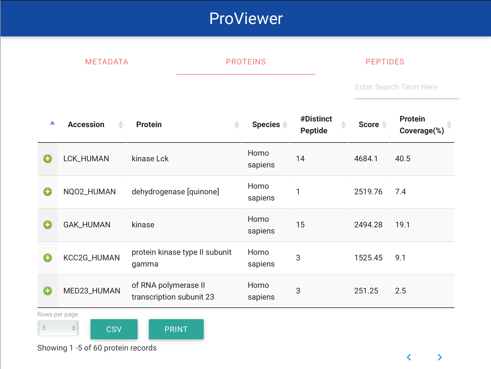
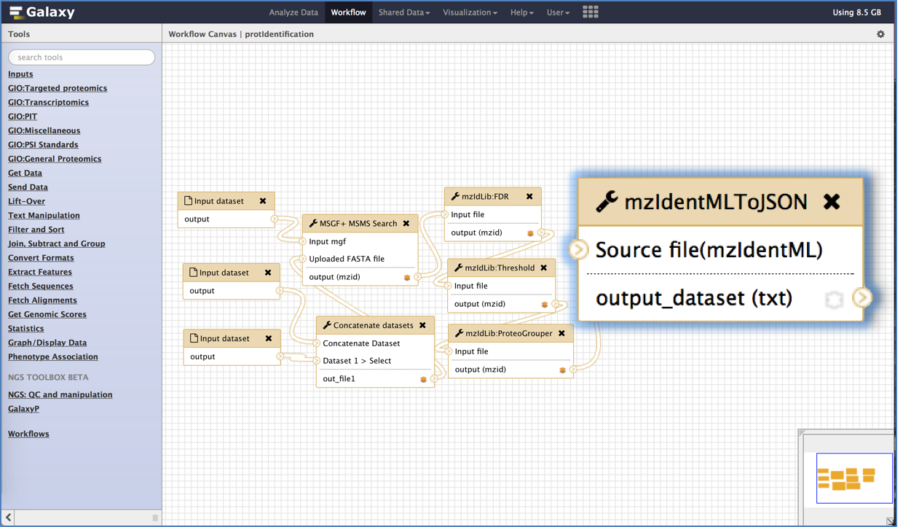

# ProViewer



ProViewer is an interactive web visualisation plug-in for the [mzIdentML](http://www.psidev.info/mzidentml) file within the [Galaxy bioinformatics platform](https://galaxyproject.org). In the repository, we provide the necessary files to install ProViewer plugin into your existing Galaxy instance accomplished with the source codes of the underneath functionality which converts mzIdentML into JSON files to be viewed in the main panel. Main folders of the repository are as follows:

* ProViewer - Galaxy visualisation plugin
  * Proviewer - client-side of the plugin
  * webcontroller - server-side of the plugin
  * tool/mzIdentMLToJSON - Galaxy tool
  * samples - sample configurations and other sample files
* ProExtractor - source code of thr Java library developed for mzIdentML data extraction
* install.py - installation setup
* Test
* Documentation

Galaxy visualisation plugin cient-side and server-side files are organised into two folders which are called *proviewer* and *webcontroller* respectively. Additionally, we have a Galaxy tool called "mzIdentMLToJSON" which generates temporary JSON files to speed up data loading for visualisation plugin. You must integrate both plugin and tool in order to work with the visualisation, as Galaxy tool contains dependency files for the visualisation plugin too. Although the integration of both plugin and tool is mandatory for installation, you can use plugin independently without using Galaxy tool. However, we strongly recommend to use our Galaxy tool prior to visualise mzIdentML files for a much faster visualising speed.

## Installation

Installation instructions are provided below. These instructions assume that you already have Galaxy installed and have admin access to that installation. If you do not already installed Galaxy or not having admin access, please refer link [here](https://wiki.galaxyproject.org/Admin/GetGalaxy).

In order to proceed, please download our repository to your machine by cloning the repository. If you download as a zip file, then extract the zip folder.

### Install Galaxy Visualisation Plugin 

#### Step 1 - Edit the configuration file

You need to make sure, you have enabled visualisation plugins on your Galaxy installation. First, go to your *galaxy.ini*  configuration file (located in ```<your galaxy directory>/config/```). If you do not have a *galaxy.ini* file, but have a  *galaxy.ini.sample* file, then make a copy of *galaxy.ini.sample* file and rename it to *galaxy.ini*. Secondly, search for *visualization_plugins_directory* setting in that  *galaxy.ini* file. If this setting has not already set, assign your visualisation directory/uncomment the (last) line as follows:

```bash
# Visualizations config directory: where to look for individual visualization plugins.
# The path is relative to the Galaxy root dir. To use an absolute path begin the path
# with '/'.
visualization_plugins_directory = config/plugins/visualizations
```

#### Step 2 - Run the installation setup file

Go to the downloaded folder of the repository from the command-line, and execute install.py file as ```python install.py``` and follow the given instructions. "Quick install" option will use all the default settings where "advanced install" option alllows to customise settings at the time of the installation. Examples are provided for advanced installation as a guide. This setup will copy installation files to your server and add all the plugin settings into a settings file called proviewer_settings.ini into ```<your galaxy directory>/config/``` location.

#### Step 3 - Copy *webcontroller* files into your web API Controller 

Go to ```<your galaxy directory>/lib/galaxy/webapps/galaxy/api/``` location, and you should be able to find a file called  **datasets.py**. There, copy and paste following codes:

  * Import these modules first:

   ```python
from MzIdentMLToJSON import MzIdentMLToJSON
from SequenceExtractor import SequenceExtractor
import os.path
import subprocess
   ```
  * There, search for Class **DatasetsController** -> method **show** and paste following code inside the method **show**:
   ```python
elif data_type == 'mzidentml':
        rval = self._mzIdentMLProcess(**kwd)
    ```
    
  * Just after **show** method add this function(Copy from the sample files provided):
  
 ```python
def _mzIdentMLProcess( self, **kwd):
        print  "MzIdentML Viewer INFO: called Web API controller!"
        # input mzIdentML file
        inputfile = kwd.get('inputFile')
        # unique sequrity encoded id assigned for the input file
        datasetId = kwd.get('datasetId')
        # galaxy root directory
        root = kwd.get('root')
        rval = inputfile
        # Web plugin loading time
        if kwd.get('event') == 'initial_load':
            converter = MzIdentMLToJSON()
            converter.extract(inputfile, datasetId, root)
        elif kwd.get('event') == 'sequence':
            seqEx = SequenceExtractor()
            rval = seqEx.extract(inputfile, kwd.get('dbSequenceId'))
        return rval
 ```
    Warning: **Mind your indentation!** As a guidance for the above step, you can find a sample *datasets.py* file in *sample* folder.

### Install Galaxy Tool

#### Step 1 - Configure Tool

Locate the *tool_conf.xml* configuration file in ```<your galaxy directory>/config/``` location. If you do not find a *tool_conf.xml* file, but have a *tool_conf.xml.sample* file, make a copy of it and rename new file as *tool_conf.xml*.
There, add these parameters anywhere of  the file under ```<toolbox>``` tag:

```XML
<section id="PSI" name="PSI Standards" >
    <tool file="mzIdentMLToJSON/mzIdentMLToJSON.xml" />
</section>
```

We have created a separate section called "PSI Standards" in the tool panel. However, you can add this tool to one of your existing tool sections by only specifying ```<tool>``` tag as below:

```XML
<tool file="mzIdentMLToJSON/mzIdentMLToJSON.xml" />
```

As a guidance for above step, sample configuration file is given in *samples* folder.

That's it! You are ready to use the visualisation plug-in and the tool.

**Note:** You must **restart server** to reflect the changes.

## How to use visualisation plugin


User *MUST* **login** to the server in order to use visualisation functionality. This visualisation is enabled for mzIdentML files only. Once you upload mzIdentML file(.mzid file extension), it will be added to the history panel. You can visualise the input mzIdentML file by clicking on the visualisation button and selecting the *mzIdentML viewer* from the menu. Time taken to load data into the viewer depends on the size of the input file.

## How to use visualisation tool



You can integrate this tool into your protein identification workflows or can execute individually. If you are using search tool in the workflow, the output mzIdentML file of the search tool is the input for this galaxy tool.

## Dependencies

* Python 2.7
* JRE 8
