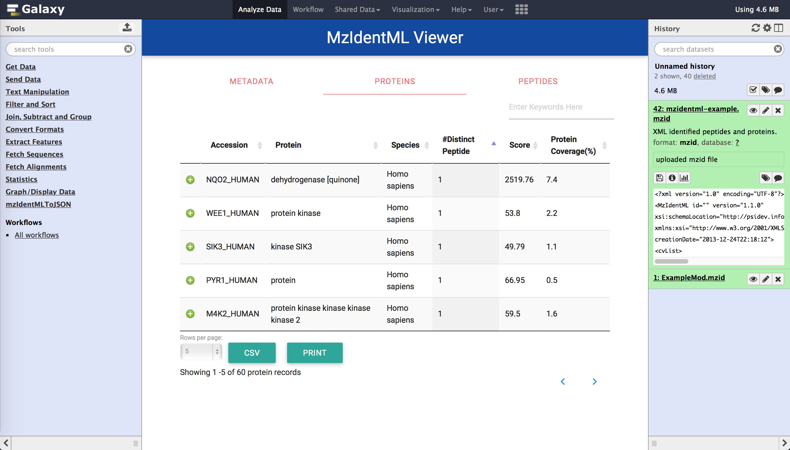

# mzIdentMLVisualiser



This is an interactive web visualisation plug-in for the [mzIdentML](http://www.psidev.info/mzidentml) file within the [Galaxy bioinformatics platform](https://galaxyproject.org). This repository provides you source code of the java library and other installation files to integrate visualisation plugin into your existing galaxy instanse. There are five main folders:
* mzIdentMLExtractor - Java library which converts proteomics data of mzIdentML to JSON files [Not required for the installation]
* mzIdentMLToJSON - Galaxy Tool
* protviewer - Galaxy plugin(client side)
* sampleFiles - sample configurations and other sample files
* webcontroller - Galaxy plugin (Server side)

Galaxy visualisation plugin files are splitted into two folders which are called protviewer and webcontroller.
Additionally, we have a galaxy tool called "mzIdentMLToJSON" which generates temporary JSON files to speed up data loading for visualisation plugin. You need to integrate both plugin and tool in order to work with the visualisation, because galaxy tool contains dependancy files for the visualisation plugin. Although it is mandatory to integrate both plugin and tool, after the integration, you can use plugin alone without using galaxy tool. However, we strongly recommend to use this galaxy tool prior to visualize mzIdentML files for a much faster visualising speed.

## Installation

Installation instructions are provided below. These instructions assume that you already have Galaxy installed and have admin access to that installation. If you do not already have Galaxy, please refer link [here](https://wiki.galaxyproject.org/Admin/GetGalaxy).

In order to proceed, please download this repository to your machine by cloning the repository. If you downloaded as a zip file, then extract the zip file.

### Install Galaxy Visualisation Plugin

#### Step 1 - Enable visualisation from the configuration file
* You need to make sure, you have enabled visualisation plugins on your Galaxy installation. Go to your *galaxy.ini* configuration file (located in ```<your galaxy directory>/config/```) and search for *visualization_plugins_directory* setting. There, assign your visualisation directory as below, if it is not already asigned:

```bash
# Visualizations config directory: where to look for individual visualization plugins.
# The path is relative to the Galaxy root dir. To use an absolute path begin the path
# with '/'.
visualization_plugins_directory = config/plugins/visualizations
```
As a guidance to above step, we have provided a sample configuration file(galaxy.ini) in *sampleConfig* folder.

#### Step 2 - Copy visualisation plugin into visualizations folder
* Copy entire *protviewer* folder to ```<your galaxy directory>/config/plugins/visualizations/``` folder

#### Step 3 - Copy Web Controller section
*  *webcontroller* directory of the downloaded repository contains following four files:
  * MzIdentMLHandler.py
  * MzIdentMLHandler.pyc
  * SequenceExtractor.py
  * SequenceExtractor.pyc. They has to be copied into your galaxy instance at ```<your galaxy directory>/lib/galaxy/webapps/galaxy/api/``` location.

* Then, in your galaxy, you sould be able to find a file called **datasets.py**. There, copy and paste following codes:

  * Import these modules first:
   ```python
      from SequenceExtractor import SequenceExtractor
      import os.path
      import subprocess
   ```
  * There, paste following code inside Class **DatasetsController** -> method **show**:
   ```python
        elif data_type == 'mzidentml':
            # input mzIdentML file
            inputfile = kwd.get('filename')
            # unique sequrity encoded id assigned for the input file
            datasetId = kwd.get('datasetId')
            rval = inputfile
            # <your galaxy directory> + paths
            outputfile = os.getcwd() + "/config/plugins/visualizations/protviewer/static/data/"
            tempFile = os.getcwd() + "/config/plugins/visualizations/protviewer/static/data/" + datasetId + "_protein.json"
            libraryLocation = os.getcwd() + "/tools/mzIdentMLToJSON/mzIdentMLExtractor.jar"
            multithreading = "true"
            # initial run
            if kwd.get('mode') == 'init':
                # if temporary JSON files not generated
                if os.path.isfile(tempFile) == False:
                    # call mzIdentMLExtractor java library
                    return subprocess.call(['java', '-jar',libraryLocation, inputfile, outputfile, datasetId, multithreading])
                else:
                    print "Info: Data loaded from the cache!"
            elif kwd.get('mode') == 'sequence':
                dbSequenceId = kwd.get('dbSequenceId')
                # extract the sequence
                seqEx = SequenceExtractor()
                sequence = seqEx.extract(inputfile, dbSequenceId)
                rval = sequence
                return rval
    ```
    Warning: Mind your indentation! As a giudance for above step, you can find a sample *datasets.py* file in *sampleFiles* folder

### Install Galaxy Tool

#### Step 1 - Configure tool

Locate the tool_conf.xml configuration file in ```<your galaxy directory>/config/``` location.
Add these parameters to anyware of  the file under <toolbox> tag:

```XML
<section name="mzIdentMLToJSON" id="mzIdentMLToJSON">
    <tool file="mzIdentMLToJSON/mzIdentMLToJSON.xml" />
</section>
```

We have created a seperate section called "mzIdentMLToJSON" in the tool panel. However, you can add this tool to one of your existing sections. As a giudance for above step, sample configuration file is given in *sampleFiles* folder.

#### Step 2 - copy tool

Copy mzIdentMLToJSON folder of the downloaded repository to your galaxy instance at ```<your galaxy directory>/tools/```.
This folder contains:
 1. wrapper - mzIdentMLToJSON.xml
 2. python script - mzIdentMLToJSON.py
 3. java library - mzIdentMLExtractor.jar
 4. java library dependancies - lib folder

**Note:** You need to restart server to reflect the changes. Users have to login to the server in order to use visualisation functionality.
